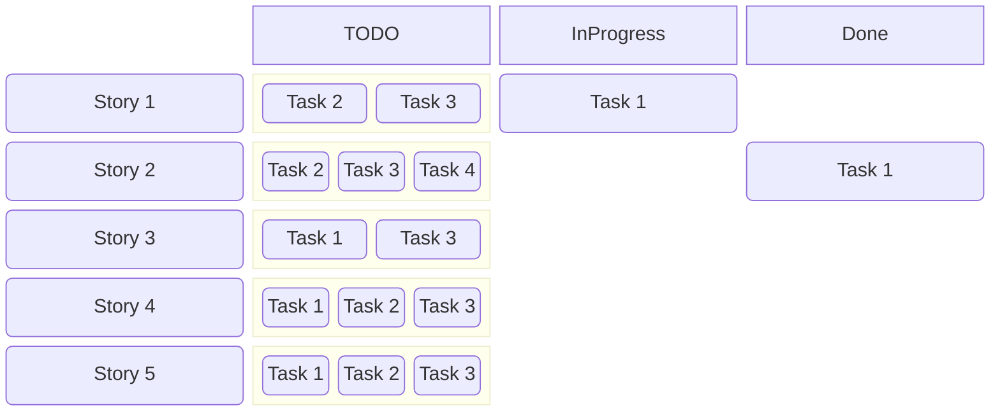

# agile-board
Agile Board for agile Teams

## Vision
As a developer I'd like to have a board for my iterations, which looks behaves like a board with sticky notes in the office.

The main fokus is the iteration(sprint) board. It should look similar to:

This is just a very simple draft of the iteration board.

## The problem
There are many solutions for agile boards. 
Many are too complex or have to many restrictions to developers.

## The wish list

as a developer I'd like to

* manage the stories and the tasks of a story like with post its
* create simple and fast the tasks for a story
* decide which columns the board has
* have issues of different products/projects on one board
* have the possibility to import and synchronize the content of the sprint with a 3rd party solution(e.g. Jira)
* manage the products backlog for a board, if it is not synchronized with a 3rd party solution(e.g. Jira)

## Documentation
The documentation of the project can be found [here](documentation/index)